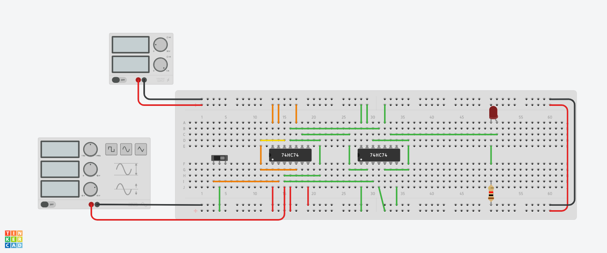
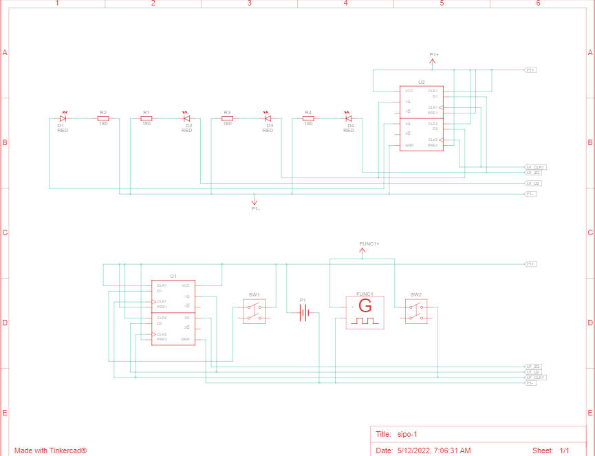
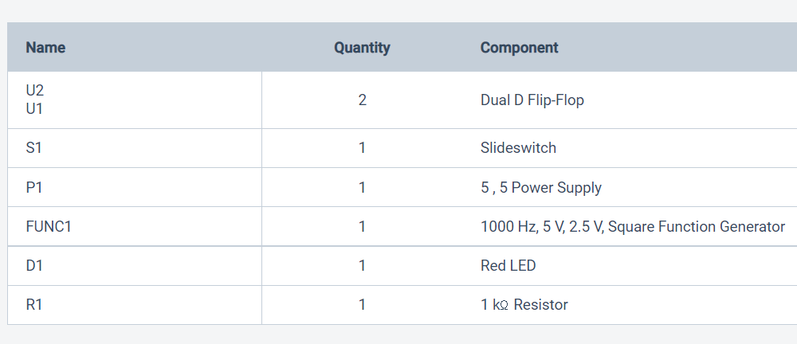
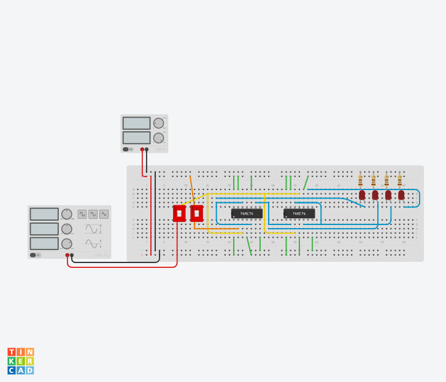
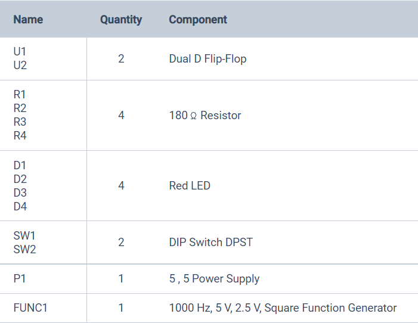
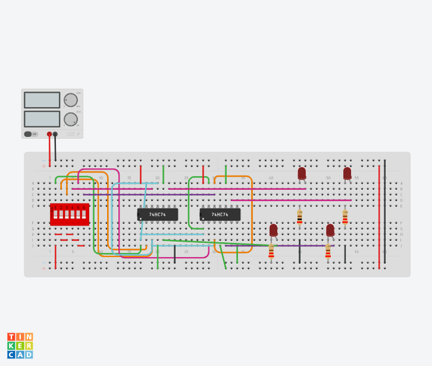
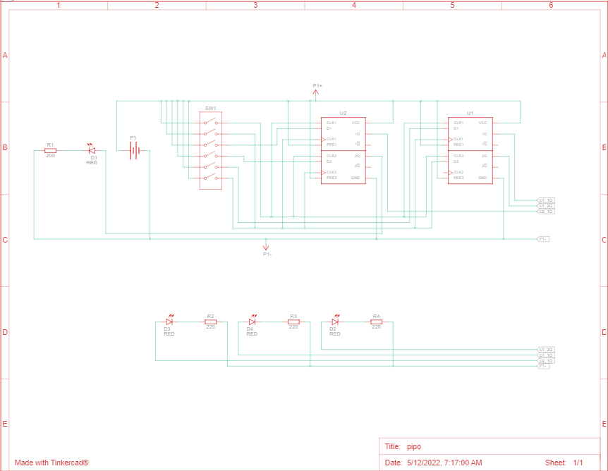
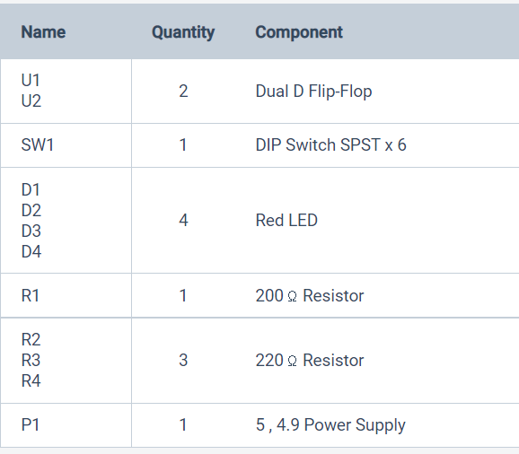

# SHIFT REGISTER
## siso shift register
The siso shift register is one of the simplest of the four configurations as it has only theer connections,the serial input (SI) which determines what enters the left hand flip-flop, the serial output(SO) which is taken from the output of the right hand flip-flop and sequencing clock signal(Clk).
## circuit

## schematic diagram

## component list

## link
Link to tinkercad is [here](https://www.tinkercad.com/things/7OdAKUCK7iY-siso/editel?sharecode=SxUTl0fseJxzmrrw0QnUV7unl9UjDjyKR0dxnAEZi4o)
## serial in parallel out(SIPO)
In SIPO shift registers,the data is stored into the register serially while it is retrieved from it in parallel-fashion.
## circuit

## schematic diagram

## components list

## link
Link to tinkercad is [here](https://www.tinkercad.com/things/gBaIJGndnsh-sipo-1/editel?sharecode=Mb-e-YDlkdmaOyLcZrmn5F6EyEp1IuebNSuciQw4Ho8)
## parallel in and parallel out (PIPO)
PIPO shift registers are the type of storage devices in which both data loading as well as data retrieval processes occur in parallel mode.
## circuit

## schematic diagram

## components list

## link
Link to tinkercad is [here](https://www.tinkercad.com/things/cqh6OT1nyX4-pipo/editel?sharecode=7ImP5mbztGKzq1YvOCgTbtict0cyO5fmPJ1AZZyJEvQ)
